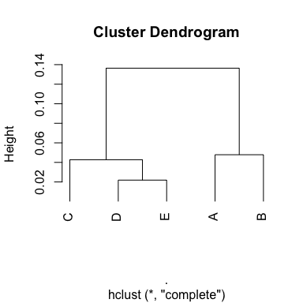

JSDについては[Qiita記事](https://qiita.com/kilometer/items/5be635edefeadaca9281)に書きました。

# 設定


```r
library(philentropy)
library(tidyverse)

set.seed(71)
```

# シンプルな例

- 2群各7データで、合計1にスケールされているもの。
- 群間のJSDを求める。


```r
.group <- 2
.N <- 7

dat <-
  data.frame(tag = rep(letters[1:.N], .group),
             key = rep(LETTERS[1:.group], each = .N),
             value = sample(1:10, .N * .group, replace = T)) %>% 
  group_by(key) %>% 
  mutate(value = value / sum(value)) %>% 
  ungroup()
```


```
## # A tibble: 14 x 3
##    tag   key    value
##    <chr> <chr>  <dbl>
##  1 a     A     0.025 
##  2 b     A     0.175 
##  3 c     A     0.05  
##  4 d     A     0.2   
##  5 e     A     0.25  
##  6 f     A     0.125 
##  7 g     A     0.175 
##  8 a     B     0.286 
##  9 b     B     0.0857
## 10 c     B     0.0571
## 11 d     B     0.114 
## 12 e     B     0.257 
## 13 f     B     0.0286
## 14 g     B     0.171
```

- 横に広げる(列合計=1)


```r
dat_wide <-
  dat %>% 
  pivot_wider(values_from = value,
              names_from = tag)
```


```
## # A tibble: 2 x 8
##   key       a      b      c     d     e      f     g
##   <chr> <dbl>  <dbl>  <dbl> <dbl> <dbl>  <dbl> <dbl>
## 1 A     0.025 0.175  0.05   0.2   0.25  0.125  0.175
## 2 B     0.286 0.0857 0.0571 0.114 0.257 0.0286 0.171
```

- 整える


```r
matrix_for_JSD <-
  dat_wide %>% 
  column_to_rownames("key") %>% 
  as.matrix() 
```


```
##           a          b          c         d         e          f         g
## A 0.0250000 0.17500000 0.05000000 0.2000000 0.2500000 0.12500000 0.1750000
## B 0.2857143 0.08571429 0.05714286 0.1142857 0.2571429 0.02857143 0.1714286
```


```r
matrix_for_JSD %>% 
  JSD()
```

```
## jensen-shannon 
##      0.1362031
```

# 群間総当たりJSDに基づくクラスタ解析

- 群数を5に増やす。


```r
.N <- 7
.group <- 5

dat <-
  data.frame(tag = rep(letters[1:.N], .group),
             key = rep(LETTERS[1:.group], each = .N),
             value = sample(1:10, .N * .group, replace = T)) %>% 
  group_by(key) %>% 
  mutate(value = value / sum(value)) %>% 
  ungroup()
```


```
## # A tibble: 35 x 3
##    tag   key    value
##    <chr> <chr>  <dbl>
##  1 a     A     0.0652
##  2 b     A     0.152 
##  3 c     A     0.217 
##  4 d     A     0.130 
##  5 e     A     0.0652
##  6 f     A     0.152 
##  7 g     A     0.217 
##  8 a     B     0.0526
##  9 b     B     0.105 
## 10 c     B     0.158 
## # … with 25 more rows
```

- 横に広げる


```r
dat_wide <-
  dat %>% 
  pivot_wider(values_from = value,
              names_from = tag)
```


```
## # A tibble: 5 x 8
##   key        a     b      c     d      e      f     g
##   <chr>  <dbl> <dbl>  <dbl> <dbl>  <dbl>  <dbl> <dbl>
## 1 A     0.0652 0.152 0.217  0.130 0.0652 0.152  0.217
## 2 B     0.0526 0.105 0.158  0.237 0.184  0.132  0.132
## 3 C     0.225  0.2   0.05   0.15  0.1    0.025  0.25 
## 4 D     0.226  0.194 0.0645 0.258 0.0323 0.0323 0.194
## 5 E     0.226  0.129 0.0645 0.258 0.0645 0.0968 0.161
```

- 後でハンドルしやすいように畳み込んでおく。


```r
dat_wide_nest <-
  dat_wide %>% 
  group_nest(key)
```


```
## # A tibble: 5 x 2
##   key                 data
##   <chr> <list<tbl_df[,7]>>
## 1 A                [1 × 7]
## 2 B                [1 × 7]
## 3 C                [1 × 7]
## 4 D                [1 × 7]
## 5 E                [1 × 7]
```

- 総当たり組み合わせを作り、データを結合する。


```r
dat_grid <- 
  dat_wide$key %>% 
  expand.grid(., .) %>% 
  as_tibble() %>% 
  left_join(dat_wide_nest %>% rename(Var1 = key), by = "Var1") %>% 
  left_join(dat_wide_nest %>% rename(Var2 = key), by = "Var2")
```


```
## # A tibble: 25 x 4
##    Var1  Var2              data.x             data.y
##    <chr> <chr> <list<tbl_df[,7]>> <list<tbl_df[,7]>>
##  1 A     A                [1 × 7]            [1 × 7]
##  2 B     A                [1 × 7]            [1 × 7]
##  3 C     A                [1 × 7]            [1 × 7]
##  4 D     A                [1 × 7]            [1 × 7]
##  5 E     A                [1 × 7]            [1 × 7]
##  6 A     B                [1 × 7]            [1 × 7]
##  7 B     B                [1 × 7]            [1 × 7]
##  8 C     B                [1 × 7]            [1 × 7]
##  9 D     B                [1 × 7]            [1 × 7]
## 10 E     B                [1 × 7]            [1 × 7]
## # … with 15 more rows
```

- `map2_dbl()`を使ってJSDを計算。


```r
dat_JSD <-
  dat_grid %>% 
  mutate(JSD = map2_dbl(data.x, data.y, 
                        ~ bind_rows(.x, .y) %>% 
                          as.matrix() %>% 
                          JSD()))
```


```
## # A tibble: 25 x 5
##    Var1  Var2              data.x             data.y    JSD
##    <chr> <chr> <list<tbl_df[,7]>> <list<tbl_df[,7]>>  <dbl>
##  1 A     A                [1 × 7]            [1 × 7] 0     
##  2 B     A                [1 × 7]            [1 × 7] 0.0478
##  3 C     A                [1 × 7]            [1 × 7] 0.117 
##  4 D     A                [1 × 7]            [1 × 7] 0.118 
##  5 E     A                [1 × 7]            [1 × 7] 0.0890
##  6 A     B                [1 × 7]            [1 × 7] 0.0478
##  7 B     B                [1 × 7]            [1 × 7] 0     
##  8 C     B                [1 × 7]            [1 × 7] 0.132 
##  9 D     B                [1 × 7]            [1 × 7] 0.136 
## 10 E     B                [1 × 7]            [1 × 7] 0.0823
## # … with 15 more rows
```

- 距離行列に変換


```r
matrix_JSD <-
  dat_JSD %>% 
  select(Var1, Var2, JSD) %>% 
  pivot_wider(values_from = JSD,
              names_from = Var2) %>%
  column_to_rownames("Var1") %>% 
  as.matrix()
```


```
##            A          B          C          D          E
## A 0.00000000 0.04784334 0.11722403 0.11773039 0.08898120
## B 0.04784334 0.00000000 0.13196027 0.13638488 0.08230476
## C 0.11722403 0.13196027 0.00000000 0.02720973 0.04270736
## D 0.11773039 0.13638488 0.02720973 0.00000000 0.02187358
## E 0.08898120 0.08230476 0.04270736 0.02187358 0.00000000
```

- 描画


```r
matrix_JSD %>% 
  as.dist() %>% 
  hclust() %>% 
  plot(hang = -1)
```

<!-- -->
